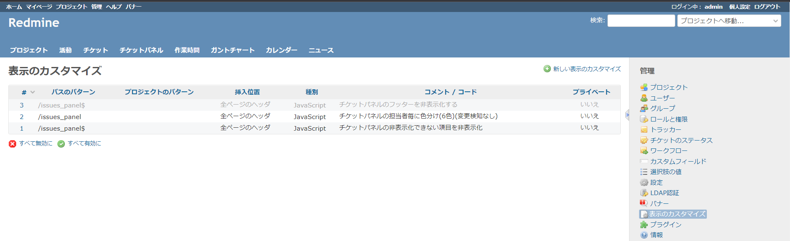
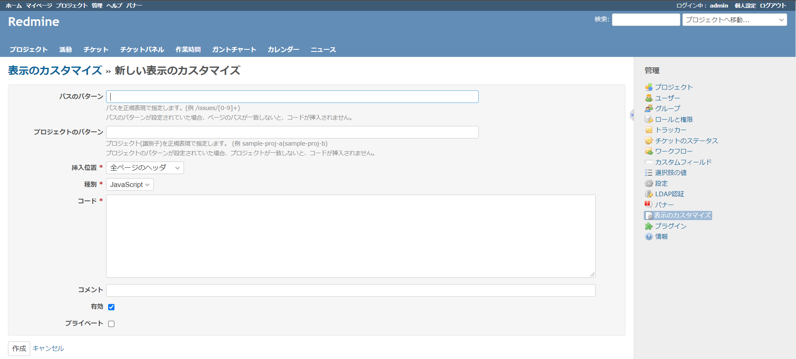
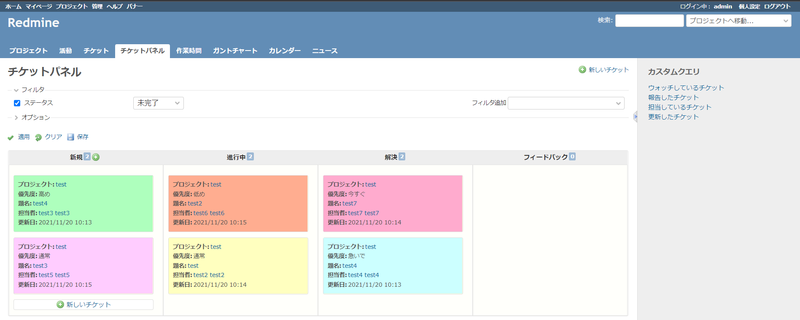

# IssuesPanelCustomize
Redmineのチケットパネルプラグインの改修

## 動作環境
- Redmine：4.1.3
- View Customize plugin：2.8.1
- Redmine Issues Panel plugin：0.0.2

## 使い方
1. [管理]＞[表示のカスタマイズ]＞[新しい表示のカスタマイズ]とクリックし、[新しい表示のカスタマイズ]画面を開く。
  
  
2. JSファイルの内容を[新しい表示のカスタマイズ]画面の[コード]欄にコピー＆ペーストし、[作成]ボタンをクリックする。
  
  
3. チケットパネル画面を開き、動作確認を実施する(/issues_panel)
  
  
  
以上
